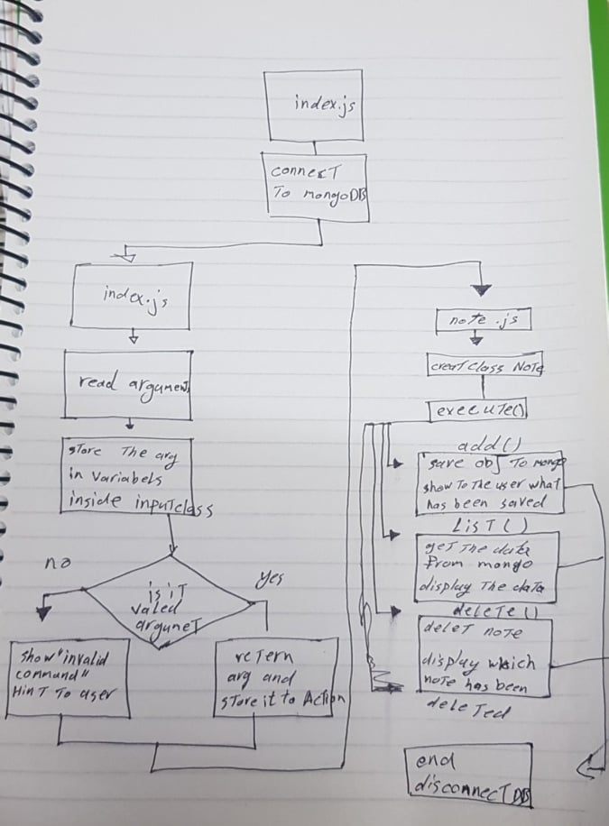

# notes
# how you can install the app

1. clone it
2. run it in your machain using node js

# How do you test the app or library?

run test in node 

# add a node 

run this commmand 

node nodes.js --add "your note"
you may use a insted of add 

## UML

